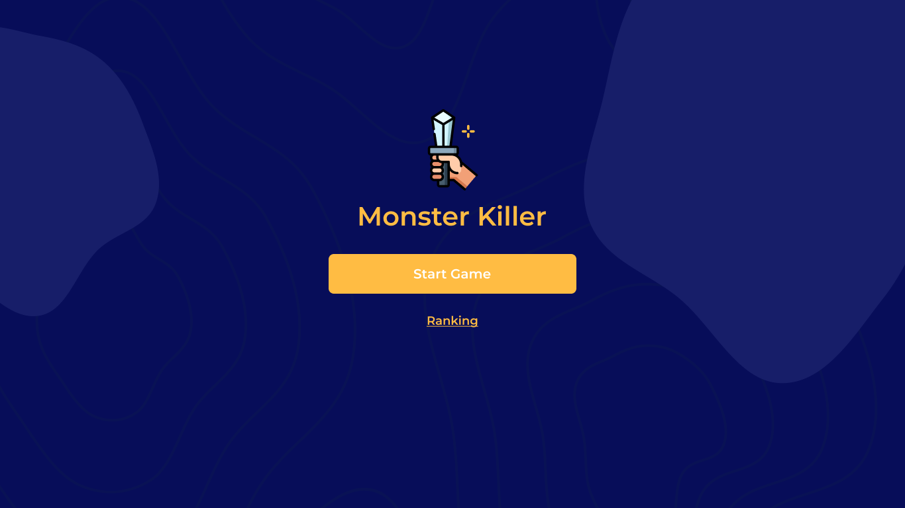
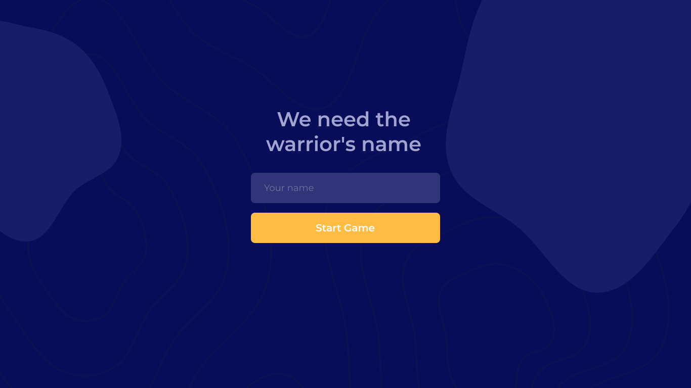
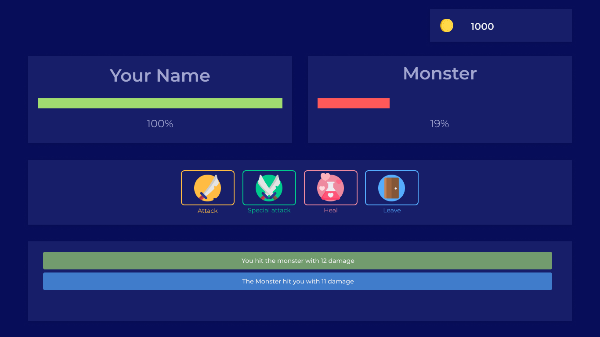

# Monster Killer Game
Monster Killer consists of a set actions that can be performed by the player, such as attacking, performing a special attack and healing in order to kill the monster.

This project aimed to put into practice knowledge acquired in the chapter on how to receive events from an insertion in DynamoDB in the Serveless course taught by [Erick Wendel](https://github.com/ErickWendel).

## User Interface

  

  

  

## developing...